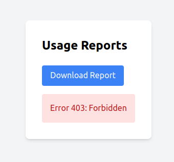

# Реализация  PKCE

### Keycloak

Чтобы настроить **PKCE** в `realm-export.json`, нужно внести изменения в настройки клиента `reports-frontend` и убедиться, что `reports-api` поддерживает корректную аутентификацию.

#### **Шаг 1. Настроить `reports-frontend` для PKCE**

Изменяем настройки клиентского приложения `reports-frontend`:

* **Удаляем**`directAccessGrantsEnabled`, так как PKCE использует Authorization Code Flow.
* **Добавляем**`standardFlowEnabled: true`, чтобы разрешить авторизацию через PKCE.
* **Добавляем**`attributes` → `pkce.code.challenge.method: S256`, чтобы явно включить PKCE.

#### **Шаг 2. Проверить настройки `reports-api`**

* Так как `reports-api` используется в режиме **bearer-only**, изменений не требуется.
* Он будет проверять `access_token`, который `reports-frontend` получает через PKCE.

#### **Шаг 3. После внесения изменений можно загрузить их в Keycloak**

это можно сделать так:

```
kcadm.sh create realms -f realm-export.json
```

или так:

```
docker exec -it keycloak-container keycloak import --file realm-export.json
```

Теперь  PKCE настроен и фронтенд будет использовать его при  авторизации.

## Запуск фронтенд + keycloak + api

Т.к. в проекте все изменения уже внесены достаточно запустить :

```
docker compose up -d
```

В  приложении пользователи проходят аутентификацию через Keycloak.  Когда пользователь пытается получить доступ к защищенному ресурсу, он перенаправляется на страницу входа Keycloak, где вводит свои учетные данные.  После успешной аутентификации Keycloak выдает токен доступа, который используется для авторизации запросов к вашему бэкенду. Далее разрешенный пользователь (prothetic1/prothetic123)  может скачать отчет.

При этом другие пользователи (например, пользователь user1/password123)  скачать отчет не могут.



**403 Forbidden**: Этот код указывает на то, что сервер понял запрос и идентифицировал клиента, но клиент не имеет достаточных прав для доступа к ресурсу. Аутентификация прошла успешно, но авторизация не позволяет выполнить запрашиваемое действие.

Если перенаправление на Keycloak не проиходит - можно настроить keycloak ( включить Standard flow), как это сделать подробно описано тут - Настройка Keycloak.md
Если возникнет желание потестировать  API бекенда - подробно описано тут - Тестирования API бекенда.md
