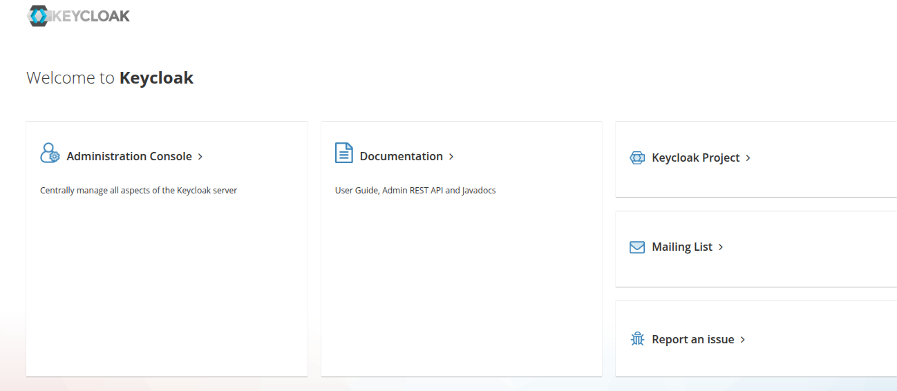
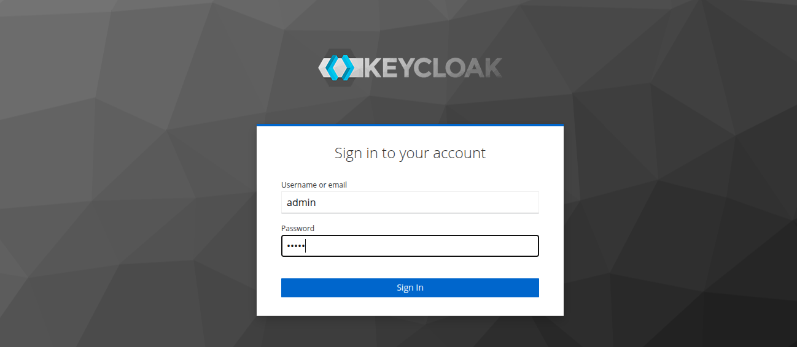
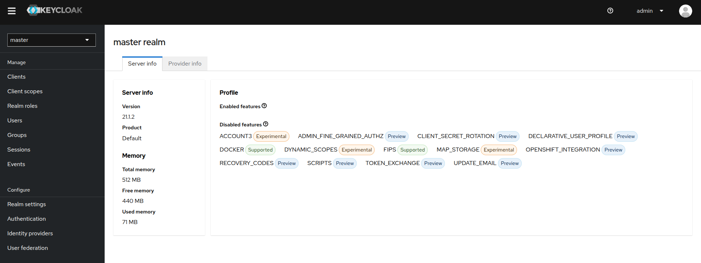
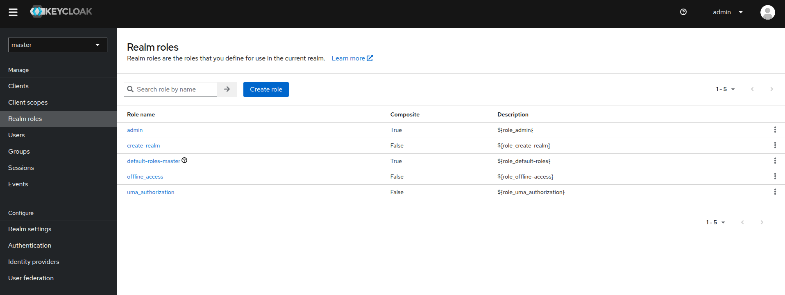
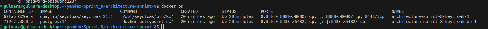
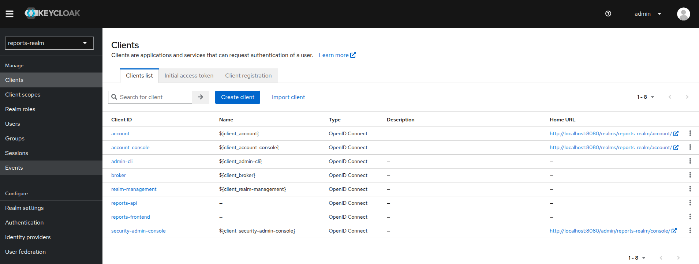
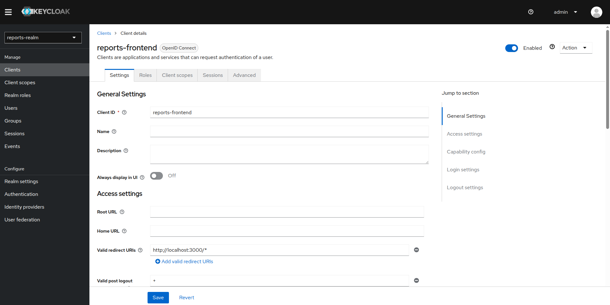
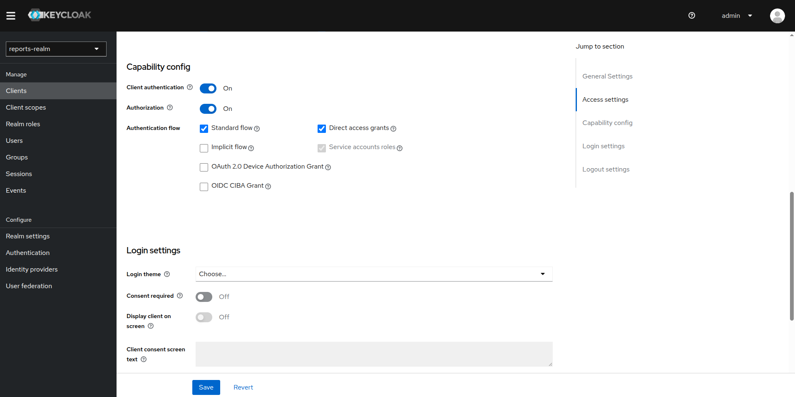
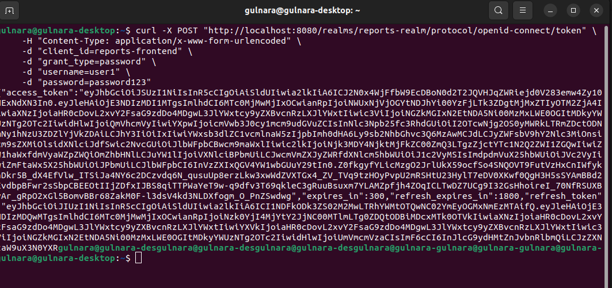

# Настройка Keycloak

Для доступа к ****Keycloak Admin Console** выполните следующие шаги:

1. **Откройте веб-браузер** и перейдите по адресу: `http://localhost:8080/`.

   
2. **Создайте учётную запись администратора**:

   * **При первом запуске Keycloak вам будет предложено создать администратора.**
   * **Введите желаемые ****имя пользователя** и **пароль****.**
   * **Нажмите кнопку ****"Create"****.**
   * 
3. **Войдите в консоль управления**:

   * **После создания учётной записи вы будете перенаправлены на страницу входа.**
   * **Введите созданные ранее ****имя пользователя** и **пароль****.**
   * **Нажмите кнопку ****"Войти"****.**
   * 

**После успешного входа вы получите доступ к ****Keycloak Admin Console****, где сможете управлять пользователями, ролями и настройками безопасности.**

****

**Примечание**: **Если вы используете Docker для запуска Keycloak, убедитесь, что контейнеры Keycloak и базы данных PostgreSQL работают корректно.**Для этого выполните команду `docker ps` и убедитесь, что оба контейнера запущены.



### **Включите Direct Access Grants для клиента:**

* **Войдите в ****Keycloak Admin Console****. - описано выше
* **Перейдите в раздел ****Clients** и выберите ваш клиент (`reports-frontend`).
* 
* **В разделе ****Settings** установите флажок **Direct Access Grants Enabled****.**(https://habr.com/ru/companies/axenix/articles/780422/)
  
* **Нажмите ****Save** для сохранения изменений.[Habr](https://habr.com/ru/companies/axenix/articles/780422/)
* 

Это позволит вашему клиенту использовать грант типа "password" для получения токена.

### **Проверьте тип доступа клиента:**

* **Убедитесь, что параметр ****Access Type** установлен в значение **public** или **confidential** в зависимости от конфигурации вашего клиента.[Habr**+1**Stack Overflow**+1**](https://habr.com/ru/companies/axenix/articles/780422/)
* **Если клиент имеет тип доступа ****confidential****, необходимо использовать **`client_secret` при запросе токена.[Habr](https://habr.com/ru/companies/axenix/articles/780422/)

Если клиент настроен как **confidential**, запрос должен включать `client_secret`:

```
curl -X POST "http://localhost:8080/realms/reports-realm/protocol/openid-connect/token" \
     -H "Content-Type: application/x-www-form-urlencoded" \
     -d "client_id=reports-frontend" \
     -d "client_secret=YOUR_CLIENT_SECRET" \
     -d "grant_type=password" \
     -d "username=user1" \
     -d "password=password123"

```

Если клиент настроен как **public**, `client_secret` не требуется:

```
curl -X POST "http://localhost:8080/realms/reports-realm/protocol/openid-connect/token" \
     -H "Content-Type: application/x-www-form-urlencoded" \
     -d "client_id=reports-frontend" \
     -d "grant_type=password" \
     -d "username=user1" \
     -d "password=password123"

```



### Проверьте кэширование конфигурации:

Иногда изменения в настройках клиента могут не применяться из-за кэширования. Рекомендуется очистить кэш Keycloak или перезапустить сервер, чтобы убедиться, что новые настройки вступили в силу.

### Убедитесь в правильности учетных данных

Убедитесь, что вы используете правильные `username` и `password` для существующего пользователя в вашем Keycloak Realm.

**Примечание:**

Использование гранта типа "password" (Resource Owner Password Credentials Grant) не рекомендуется для публичных клиентов из соображений безопасности.**Рекомендуется использовать ****Authorization Code Flow** с PKCE для повышения безопасности.

Следуя этим шагам, вы сможете настроить ваш клиент в Keycloak для использования Direct Access Grants и успешно получать токены с помощью гранта типа "password".
